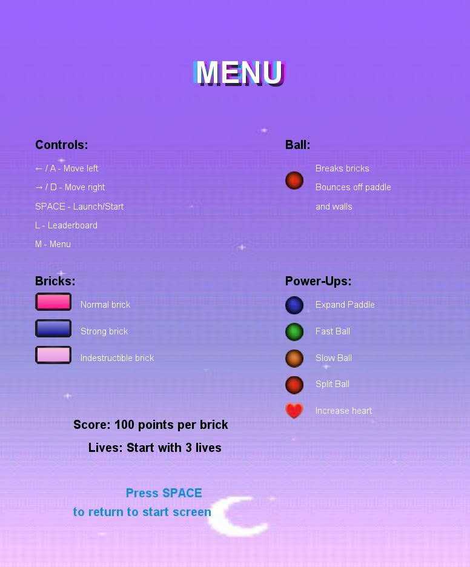

# Arkanoid OOP Group Project
## OOP class INT2214_63 Group Project

This group project aims to consolidate knowledge of object-oriented programming (OOP) through developing a simple version of the classic game Arkanoid. Students will apply basic OOP principles such as encapsulation, inheritance, polymorphism and abstraction to build a well-structured, maintainable and extensible application.

The objectives of this project are:
* Master and apply OOP principles to software design and implementation.
* Develop analytical, system design and problem-solving skills.
* Build a complete game application from Terminal version to graphical interface.
* Practice teamwork and software project management skills.

Reference for this project goal:
[Arkanoid game](https://www.youtube.com/shorts/CkincBpA3ro)

## 🎮 Game Screenshots

Here are some screenshots from the Arkanoid OOP Game:

## How to Play the Game

1. **Download the game files** from the link below:
   [Download Arkanoid Game](https://drive.google.com/drive/folders/1vhylDyjXVg3GdHloRtBWPOA6Sat18qKH?usp=sharing)

2. **Extract the folder**: After downloading, unzip the folder to a location of your choice.

3. **Run the Game**: Open the extracted folder and double-click on the file `Arkanoid.exe` to start playing the game.

Enjoy the game!
